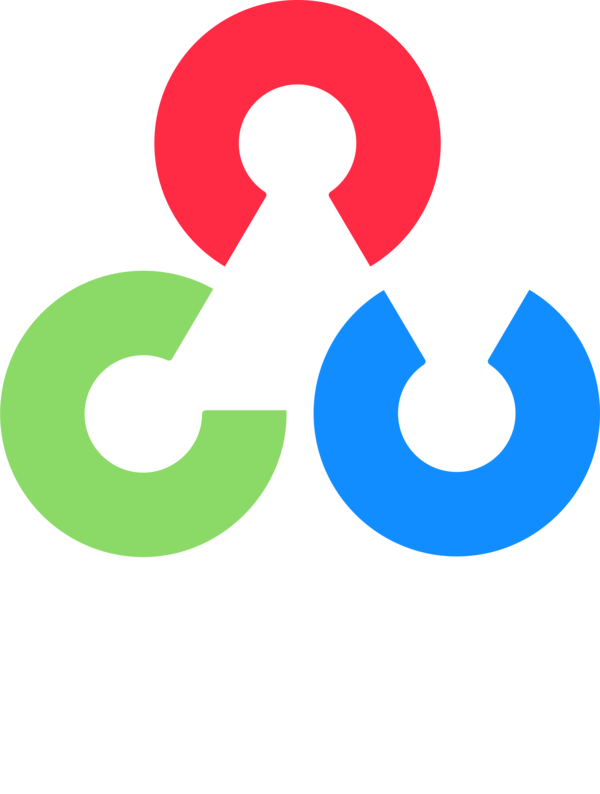

<!------------------------------------------------------------------------------>
# Flutter Developments
|No.|Repository name|Code size & Last commit |Technologies used|
|---|---|---|---|
|1|[Img-To-PDF-Converter](https://github.com/AbhilashTUofficial/Img-To-PDF-Converter)| |[][flutter][][flutter][][android]|
|2|[Travel-App-Flutter](https://github.com/AbhilashTUofficial/Travel-App-Flutter)| |[][flutter][][flutter][][android]|
|3|[Covid19-Dashboard-Flutter](https://github.com/AbhilashTUofficial/Covid19-Dashboard-Flutter)| |[][flutter][][flutter][][android]|
|4|[Social-Media-App-Flutter](https://github.com/AbhilashTUofficial/Social-Media-App-Flutter)| |[][flutter][][flutter][][android]|
|5|[CloneApps](https://github.com/AbhilashTUofficial/CloneApps)| |[][flutter][][flutter][][android]|
|6|[Instagram-Clone-Flutter](https://github.com/AbhilashTUofficial/Instagram-Clone-Flutter)| |[][flutter][][flutter][][android]|
|7|[WhatsApp-Clone-Flutter](https://github.com/AbhilashTUofficial/WhatsApp-Clone-Flutter)| |[][flutter][][flutter][][android]|
|8|[Tinder-Clone-Flutter](https://github.com/AbhilashTUofficial/Tinder-Clone-Flutter)| |[][flutter][][flutter][][android]|
|9|[GoogleClassRoom-Clone-Flutter](https://github.com/AbhilashTUofficial/GoogleClassRoom-Clone-Flutter)| |[][flutter][][flutter][][android]|
|10|[Calculator-Flutter](https://github.com/AbhilashTUofficial/Calculator-Flutter)| |[][flutter][][flutter][][android]|
|11|[ClockApp-Flutter](https://github.com/AbhilashTUofficial/ClockApp-Flutter)| |[][flutter][][flutter][][android]|
|12|[QuizApp-Flutter](https://github.com/AbhilashTUofficial/QuizApp-Flutter)| |[][flutter][][flutter][][android]|
|13|[Flutter-programming](https://github.com/AbhilashTUofficial/Flutter-programming)| |[][flutter][][flutter][][android]|
 
<!------------------------------------------------------------------------------>
<!------------------------------------------------------------------------------>
<!------------------------------------------------------------------------------>
<!------------------------------------------------------------------------------>
 

# Java Programming
|No.|Repository name|Code size & Last commit |Technologies used|
|---|---|---|---|
|1|[Java-Calculator](https://github.com/AbhilashTUofficial/Java-Calculator)| |[][java][][android]|
|2|[BlockCrush-JavaGame](https://github.com/AbhilashTUofficial/BlockCrush-JavaGame)| |[][java][][java]|
|3|[Pong-JavaGame](https://github.com/AbhilashTUofficial/Pong-JavaGame)| |[][java][][java]|
|4|[Dynamic-programming](https://github.com/AbhilashTUofficial/Dynamic-programming)| |[][java][][java]|
|5|[Sorting](https://github.com/AbhilashTUofficial/Sorting)| |[][java][][java]|
|6|[JavaLab](https://github.com/AbhilashTUofficial/JavaLab)| |[][java][][java]|
|7|[CrosswordPuzzle-Java](https://github.com/AbhilashTUofficial/CrosswordPuzzle-Java)| |[][java][][java]|
|8|[TicTacToeGame-Java](https://github.com/AbhilashTUofficial/TicTacToeGame-Java)| |[][java][][java]|
|9|[AgeCalculator-Java](https://github.com/AbhilashTUofficial/AgeCalculator-Java)| |[][java][][java]|
|10|[SnakeGame-Java](https://github.com/AbhilashTUofficial/SnakeGame-Java)| |[][java][][java]|
|11|[Converter-Java](https://github.com/AbhilashTUofficial/Converter-Java)| |[][java][][java]|
|12|[Clock-Java](https://github.com/AbhilashTUofficial/Clock-Java)| |[][java][][java]|
|13|[FileMetadata-Java](https://github.com/AbhilashTUofficial/FileMetadata-Java)| |[][java][][java]|
|14|[IPFinder-Java](https://github.com/AbhilashTUofficial/IPFinder-Java)| |[][java][][java]|
|15|[Calculator-Java](https://github.com/AbhilashTUofficial/Calculator-Java)| |[][java][][java]|
|16|[TU Text Editor](https://github.com/AbhilashTUofficial/TU-TextEditor-Java)| |[][java][][python][][java]|
|17|[Games](https://github.com/AbhilashTUofficial/Games)| |[][java][][python][][java]|
|18|[java-programming](https://github.com/AbhilashTUofficial/java-programming)| |[][java][][java]|

 
<!------------------------------------------------------------------------------>
<!------------------------------------------------------------------------------>
<!------------------------------------------------------------------------------>
<!------------------------------------------------------------------------------>
 

# Python Programming
|No.|Repository name|Code size & Last commit |Technologies used|
|---|---|---|---|
|1|[TicTacToe-PythonGame](https://github.com/AbhilashTUofficial/TicTacToe-PythonGame)| |[][python][][python]|
|2|[Connect4-PythonGame](https://github.com/AbhilashTUofficial/Connect4-PythonGame)| |[][python][][python]|
|3|[Snake-PythonGame](https://github.com/AbhilashTUofficial/Snake-PythonGame)| |[][python][][python]|
|4|[Pong Game](https://github.com/AbhilashTUofficial/Pong-PythonGame)| |[][python][][python]|
|5|[Jupyter-Notebook](https://github.com/AbhilashTUofficial/Jupyter-Notebook)| |[][python][][python][][python]|
|6|[Python-programming](https://github.com/AbhilashTUofficial/Python-programming)| |[][python][][python]|
 

# JavaScript Programming
|No.|Repository name|Code size & Last commit |Technologies used|
|---|---|---|---|
|1|[DynamicProgramming](https://github.com/AbhilashTUofficial/DynamicProgramming)| |[][js][][js]|
|1|[RockPaperScissorsGame](https://github.com/AbhilashTUofficial/RockPaperScissorsGame-JavaScript)| |[][js][][js]|
|1|[MemoryGame](https://github.com/AbhilashTUofficial/MemoryGame-JavaScript)| |[][js][][js]|
|1|[Whatsapp-chatbot](https://github.com/AbhilashTUofficial/Whatsapp-chatbot-Script)| |[][js][][js]|
|1|[JavaScript-programming](https://github.com/AbhilashTUofficial/JavaScript-programming)| |[][js][][js]|

[flutter]: https://github.com/AbhilashTUofficial/Flutter-programming
[android]: https://github.com/AbhilashTUofficial/Img-To-PDF-Converter
[java]: https://github.com/AbhilashTUofficial/java-programming
[python]: https://github.com/AbhilashTUofficial/Python-programming
[js]: https://github.com/AbhilashTUofficial/JavaScript-programming